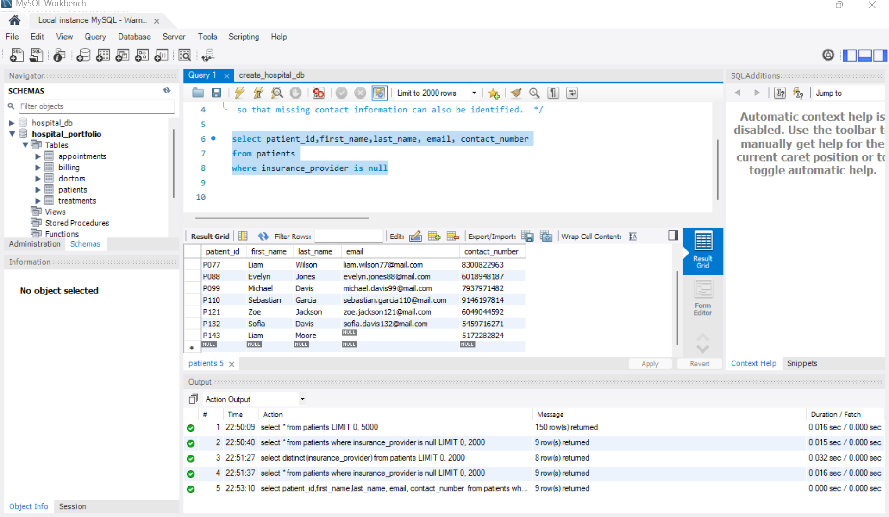
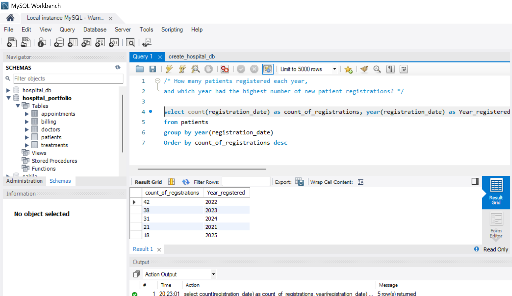
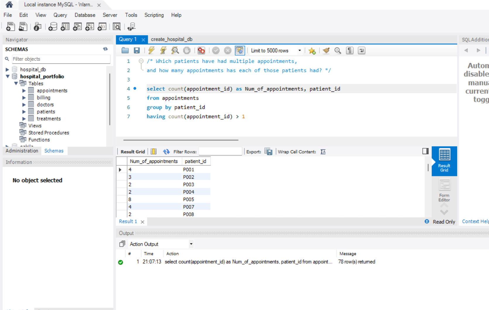
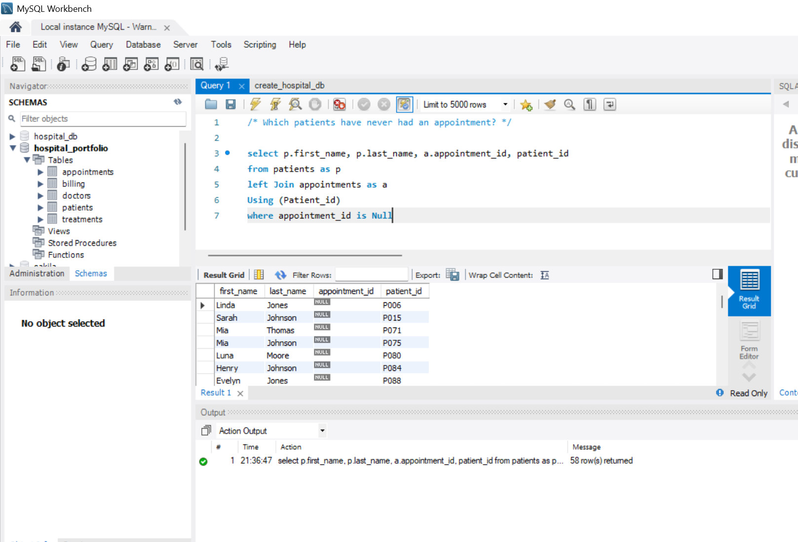
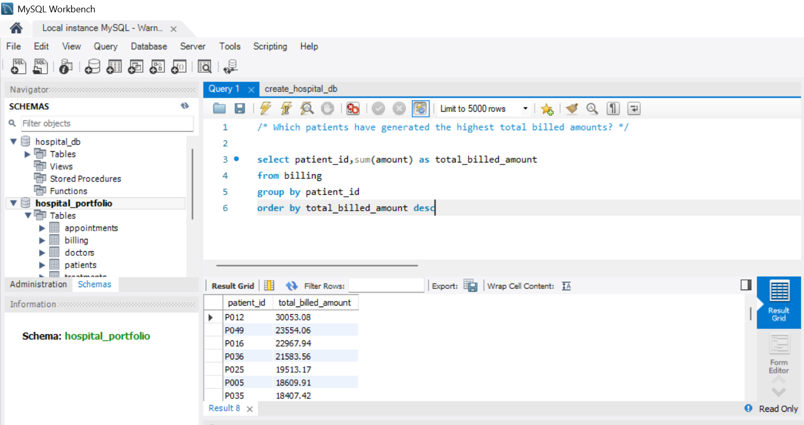

# healthcare-sql-analysis
SQL portfolio project analyzing patient demographics, appointments, treatments, billing, and healthcare operations using MySQL.

## Patient & Insurance Analysis

### Question 1: Insurance Provider Patient Volume

**Business Question:**  
Among patients with documented insurance coverage, how many patients are covered by each insurance provider? Only include providers covering more than 10 patients and rank them from highest to lowest patient volume.

**SQL Query:**

```sql
SELECT COUNT(insurance_provider) AS insurance_provider_count,
       insurance_provider
FROM patients
WHERE insurance_provider IS NOT NULL
GROUP BY insurance_provider
HAVING COUNT(insurance_provider) > 10
ORDER BY insurance_provider_count DESC;
```
**Finding:**  
WellnessCorp had the highest patient volume with 38 covered patients. Five other insurance providers also met the threshold of more than 10 patients: PulseSecure, CarePlus, MedCare Plus, HealthFirst, and MediShield.


**Query Results:**


### Question 2: Missing Insurance & Contact Information

**Business Question:**  
Identify patients without a documented insurance provider and review their contact information to determine whether additional contact data is missing.

**SQL Query:**

```sql
SELECT patient_id, first_name, last_name, email, contact_number
FROM patients
WHERE insurance_provider IS NULL;
```

**Finding:**  
Among patients without a documented insurance provider, only patient P143 was also missing an email address. All patients in this group had a contact number documented.

**Query Results:**

                                 
### Question 3: Patient Registrations by Year

**Business Question:**  
How many patients registered each year, and which year had the highest number of new patient registrations?

**SQL Query:**

```sql
SELECT COUNT(registration_date) AS count_of_registrations,
       YEAR(registration_date) AS Year_registered
FROM patients
GROUP BY YEAR(registration_date)
ORDER BY count_of_registrations DESC;
```

**Finding:**  
2022 had the highest number of new patient registrations, with 42 patients registered.

**Query Results:**

                          
### Question 4: Patients With Multiple Appointments

**Business Question:**  
Which patients have had multiple appointments, and how many appointments has each of those patients had?

**SQL Query:**

```sql
SELECT COUNT(appointment_id) AS Num_of_appointments,
       patient_id
FROM appointments
GROUP BY patient_id
HAVING COUNT(appointment_id) > 1;
```

**Finding:**  
Patients with more than one appointment were identified by grouping appointments by patient and filtering for appointment counts greater than one.

**Query Results:**

                                          

### Question 5: Patients Without Appointments

**Business Question:**  
Which patients have never had an appointment?

**SQL Query:**

```sql
SELECT p.first_name, p.last_name, a.appointment_id, patient_id
FROM patients AS p
LEFT JOIN appointments AS a
USING (patient_id)
WHERE a.appointment_id IS NULL;
```

**Finding:**  
Patients with no matching appointment record were identified using a LEFT JOIN between the patients and appointments tables and filtering for NULL appointment IDs.

**Query Results:**

                            

### Question 6: Highest Total Billed Amounts by Patient

**Business Question:**  
Which patients have generated the highest total billed amounts?

**SQL Query:**

```sql
SELECT patient_id,
       SUM(amount) AS total_billed_amount
FROM billing
GROUP BY patient_id
ORDER BY total_billed_amount DESC;
```

**Finding:**  
Patient 'P012' generated the highest total billed amount at $30053.08.

**Query Results:**

                                                                                                           
### Question 7: Highest Average Treatment Cost Among Patients With Multiple Appointments

**Business Question:**  
For patients with multiple appointments, which patients have the highest average treatment cost?

**SQL Query:**

```sql
SELECT AVG(cost) AS Average_cost,
       COUNT(DISTINCT appointment_id) AS count_of_appointments,
       a.patient_id
FROM appointments AS a
LEFT JOIN treatments
USING (appointment_id)
GROUP BY patient_id
HAVING COUNT(DISTINCT appointment_id) > 1
ORDER BY Average_cost DESC;
```

**Finding:**  
Patient P044 had the highest average treatment cost at $4,662.05 across 2 appointments.

**Query Results:**


